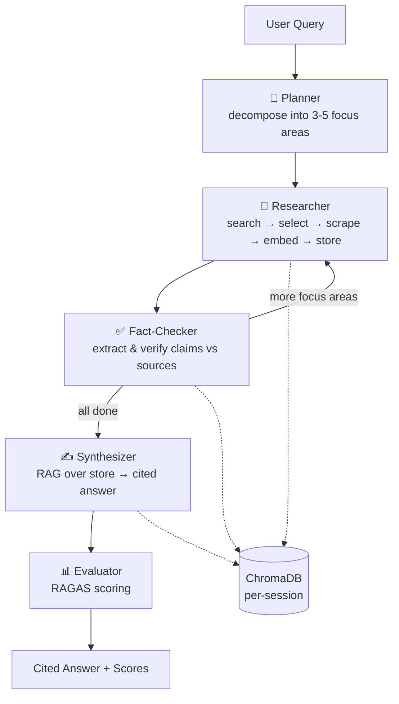

# 🔬 AI Research Assistant


A **multi-agent research system** that takes a question, autonomously plans and
executes web research, fact-checks its findings against the sources it retrieved,
and produces a **fully-cited synthesized answer** — then grades its own output with
**RAGAS** quality metrics.

## 🎥 Demo

[](https://youtu.be/QoKrNUio_0M)

▶️ **[Watch the walkthrough](https://youtu.be/QoKrNUio_0M)** — live agent-by-agent
progress streaming, the final cited answer, and the RAGAS self-evaluation scores.

## ❓ Why this exists

LLMs answer fluently but **hallucinate**, can't cite where a claim came from, and
give you no way to know whether an answer is actually trustworthy. Manually
researching a question — searching, opening a dozen tabs, cross-checking facts,
and writing a cited summary — is slow and tedious.

This project automates that workflow with a **team of specialized agents** and, just
as importantly, **measures the quality of its own answers** with RAGAS so reliability
is a number, not a vibe. It's built to demonstrate three things that matter in real
AI engineering: (1) **orchestrating multiple agents** with explicit control flow and a
verification loop, (2) **grounding** every answer in retrieved sources with inline
citations (RAG), and (3) **evaluating** the system rigorously — including a
fact-checker **ablation** and an honest read of where the metrics (and the metric
*tooling*) have limits.

Built on **LangGraph** with a swappable LLM backend (local **Ollama** `llama3.1:8b`
on GPU, or hosted **Groq** `llama-3.3-70b`), a per-session **ChromaDB** vector store
for RAG, a **FastAPI + WebSocket** backend that streams live progress, and a
**Streamlit** UI.

---

## ✨ Highlights

- **5 specialized agents** orchestrated as a stateful LangGraph graph with a
  research/fact-check **loop** over prioritized focus areas.
- **Retrieval-Augmented Generation** — scraped content is chunked, embedded
  (MiniLM), and stored in a per-session ChromaDB collection; the synthesizer answers
  *only* from retrieved context and emits inline `[N]` citations.
- **Self-evaluation** — every answer is scored with RAGAS (faithfulness, answer
  relevancy, context precision), judged by a stronger model (OpenRouter `gpt-4o-mini`)
  for reliable structured output.
- **Live progress** streamed agent-by-agent over a WebSocket to the UI.
- **Provider-agnostic** — switch local⇄hosted LLM with a single env var.
- **Persistent history** — every run is stored in SQLite and replayable.
- **Containerized** — `docker compose up` for backend + frontend (Ollama stays
  native on the host for GPU access).

---

## 🏗️ Architecture



| Agent | Role |
|-------|------|
| **Planner** | Decomposes the query into 3–5 prioritized, non-overlapping focus areas (structured JSON). |
| **Researcher** | Per focus area: generates search queries → Tavily search → LLM selects best URLs → async scrape (trafilatura + BS4) → chunk/embed/store in ChromaDB. |
| **Fact-Checker** | Extracts verifiable claims from new content and verifies each against the session's stored sources (with a Tavily fallback); advances the loop. |
| **Synthesizer** | RAG retrieval over the session store + verified claims → comprehensive markdown answer with inline `[N]` citations. |
| **Evaluator** | Scores the answer with RAGAS (faithfulness, answer relevancy, context precision) using a reliable judge LLM (OpenRouter `gpt-4o-mini`, with Groq/Ollama fallbacks). |

### Tech stack
**LangGraph** · **LangChain 0.3** · **Ollama** / **Groq** · **ChromaDB** ·
**sentence-transformers (MiniLM)** · **Tavily** · **trafilatura** · **RAGAS** ·
**FastAPI** · **WebSockets** · **SQLAlchemy / SQLite** · **Streamlit** · **Docker**

---

## 📊 Evaluation & ablation

Quality isn't asserted — it's **measured**. A reproducible harness
(`benchmark/run_eval.py`) runs a fixed question set through the pipeline and averages
the RAGAS scores. Crucially, it runs **two variants** to isolate the value of the
fact-checking agent:

- **full** — the complete graph
- **no_factcheck** — the fact-checker swapped for a no-op (ablation)

> Numbers below are auto-generated into [`benchmark/RESULTS.md`](benchmark/RESULTS.md).
> Regenerate with `python -m benchmark.run_eval`.

<!-- RESULTS:START -->
**12 questions × 2 variants** · pipeline on local `llama3.1:8b` · judged by OpenRouter
`gpt-4o-mini`. Headline = **median** (robust); mean in parentheses.

| Variant | N | Faithfulness | Answer Relevancy | Context Precision |
|---------|:-:|:-:|:-:|:-:|
| **full** (with fact-checker) | 12 | **0.978** (0.936) | **0.957** (0.774) | **0.974** (0.964) |
| no_factcheck (ablation) | 12 | 0.976 (0.908) | 0.834 (0.604) | 0.982 (0.937) |

**Controlled ablation — both variants synthesized & scored over the _identical_
retrieved corpus** (built once per question; only the fact-checker's verified claims
differ — avg 13/answer vs 0). Δ = full − no_factcheck:

| Metric | Δ median | Δ mean |
|--------|:-:|:-:|
| faithfulness | +0.002 | +0.028 |
| answer_relevancy | +0.123 | +0.170 |
| context_precision | −0.008 | +0.027 |

> **Takeaway:** with retrieval held identical, the fact-checking agent gives a
> **small but consistent improvement** — answer relevancy and faithfulness both rise,
> context precision is unchanged. The verified claims give the synthesizer focused,
> cross-checked facts to anchor the answer.
>
> **Reading the numbers honestly:**
> - The relevancy gap looks large by mean (+0.170) but that's **inflated by RAGAS
>   artifacts**: its *noncommittal* classifier spuriously scores `0.0` on some
>   genuinely relevant answers (`no_factcheck` hit 4 such, `full` 2 — all confirmed
>   on-topic; answers saved in [`results.json`](benchmark/results.json)). Excluding
>   those zeros, mean relevancy is **0.929 (full) vs 0.906 (no_factcheck), a +0.023
>   effect** — real but modest. The robust **median is +0.123**.
> - *Faithfulness* median 0.978 (6/12 perfect 1.0); the controlled +0.028 mean is the
>   honest size of the fact-checker's grounding benefit.
> - Earlier, an *uncontrolled* ablation (two independent pipelines) buried this signal
>   in web-retrieval variance — fixing the experiment design surfaced it.
>
> Full per-query analysis + saved answers in
> [`benchmark/RESULTS.md`](benchmark/RESULTS.md) / [`results.json`](benchmark/results.json).
<!-- RESULTS:END -->

> Faithfulness = answer is grounded in retrieved context · Answer relevancy = answer
> addresses the question · Context precision = the retrieved chunks are on-topic.
> Context precision is computed over the **chunks actually fed to the synthesizer**
> (relevance-filtered), not whole scraped pages — see `backend/agents/synthesizer.py`.

```bash
python -m benchmark.run_eval                  # both variants, full question set
python -m benchmark.run_eval --limit 3        # quick smoke run
python -m benchmark.run_eval --report-only    # rebuild the table from cache
```

---

## 🚀 Quickstart (local)

**Prerequisites:** Python 3.11/3.12, [Ollama](https://ollama.com), a free
[Tavily API key](https://tavily.com), and (for evaluation) a judge LLM —
an [OpenRouter key](https://openrouter.ai) (recommended, ~$0.20 for the full
benchmark) or a [Groq key](https://console.groq.com); without either, RAGAS falls
back to the local model.

```bash
git clone https://github.com/NirbhaySharma504/ai-research-assistant.git
cd ai-research-assistant

python3.12 -m venv .venv && source .venv/bin/activate
pip install --upgrade pip && pip install -r requirements.txt

cp .env.example .env        # add TAVILY_API_KEY (and OPENROUTER_API_KEY for RAGAS eval)

# Local model (GPU auto-detected on Linux):
ollama pull llama3.1:8b

# Sanity check the full pipeline from the CLI:
python -m scripts.run_research "What are the main causes of climate change?"
```

### Run the app
```bash
# Terminal 1 — backend (FastAPI + WebSocket)
uvicorn backend.api.app:app --reload --port 8000

# Terminal 2 — frontend (Streamlit)
streamlit run frontend/app.py
```
Open **http://localhost:8501**. API docs at **http://localhost:8000/docs**.

---

## 🐳 Run with Docker

Ollama stays **native on the host** (so it keeps GPU access); the containers reach it
via `host.docker.internal`.

```bash
# On the host:
ollama serve            # if not already running as a service
ollama pull llama3.1:8b

# .env must contain TAVILY_API_KEY (compose reads it):
docker compose up --build
```
Frontend → http://localhost:8501 · Backend → http://localhost:8000

---

## 🌐 Live demo / deployment

The backend needs **Ollama + a GPU** for local inference, so it isn't a fit for free
hosting tiers — the recommended setup is a **deployed Streamlit frontend** talking to a
**self-hosted backend**:

1. Run the backend locally (`uvicorn …` or `docker compose up backend`) on your
   GPU machine.
2. Expose it with a tunnel: `cloudflared tunnel --url http://localhost:8000`
   (or `ngrok http 8000`).
3. Deploy `frontend/app.py` to **Streamlit Community Cloud** and set
   `BACKEND_URL` (to the tunnel URL) in the app's **Secrets** —
   see [`.streamlit/secrets.toml.example`](.streamlit/secrets.toml.example).

The frontend resolves its backend from `BACKEND_URL` (env var → Streamlit secret →
`localhost`), so the same code runs locally and in the cloud unchanged. Since the
backend's GPU dependency makes an always-on public demo impractical on free tiers, the
[demo video](https://youtu.be/QoKrNUio_0M) is the canonical "see it working" artifact,
with the local quickstart above as the interactive path.

## 🔭 Observability

Every agent step and LLM call can be traced in **LangSmith** — set
`LANGCHAIN_TRACING_V2=true` and `LANGCHAIN_API_KEY` in `.env` (see
[`.env.example`](.env.example)). LangGraph emits traces automatically; tracing is a
no-op when unset, so there's zero overhead by default. This makes the otherwise
opaque multi-agent loop debuggable: you can see each node's prompt, output, latency,
and the full research → fact-check → synthesize path.

## 🔌 API

| Method | Path | Description |
|--------|------|-------------|
| `GET`  | `/api/health` | Liveness check. |
| `POST` | `/api/research` | Run a query to completion (blocking). Body: `{query, max_iterations}`. |
| `GET`  | `/api/history` | List past runs. |
| `GET`  | `/api/research/{session_id}` | Fetch a stored run. |
| `WS`   | `/ws/research` | Send `{query, max_iterations}`; receive `started` → `progress`×N → `complete` events. |

---

## ⚙️ Configuration (`.env`)

| Variable | Default | Notes |
|----------|---------|-------|
| `LLM_PROVIDER` | `ollama` | `ollama` (local) or `groq` (hosted) — the pipeline LLM. |
| `OLLAMA_MODEL` | `llama3.1:8b` | Local model. |
| `OPENROUTER_API_KEY` | — | Preferred RAGAS judge (`gpt-4o-mini`); most reliable. |
| `GROQ_API_KEY` | — | Alternative judge + hosted LLM-provider swap. |
| `TAVILY_API_KEY` | — | **Required** for web search. |
| `MAX_RESULTS_PER_SEARCH` | `5` | Tavily results per query. |
| `CHUNK_SIZE` / `CHUNK_OVERLAP` | `512` / `50` | RAG chunking. |
| `RETRIEVAL_TOP_K` | `8` | Chunks retrieved for the synthesizer. |
| `CONTEXT_MAX_DISTANCE` | `0.70` | Cosine-distance ceiling for a chunk to count as relevant (improves context precision). |

---

## 📁 Project structure

```
backend/
  agents/        planner, researcher, fact_checker, synthesizer, evaluator, utils
  graph/         state, edges, research_graph (assembly + ablation), runner (streaming)
  tools/         search (Tavily), scraper (trafilatura+BS4), vector_store (ChromaDB)
  api/           FastAPI app (REST + WebSocket), schemas
  db/            SQLAlchemy models, crud, database
  config.py      pydantic-settings · llm.py  provider factory + judge
  observability.py   opt-in LangSmith tracing
frontend/app.py  Streamlit UI (live progress over WebSocket + history)
benchmark/       run_eval.py (RAGAS harness + ablation), questions, RESULTS.md
scripts/run_research.py   CLI runner
tests/           offline unit tests (pytest)
.github/workflows/ci.yml  CI: install + pytest on every push/PR
```

## 🧪 Tests

```bash
pytest tests/ -q     # fast, offline unit tests (JSON parsing, routing, score cleaning)
```
CI runs these on every push/PR via GitHub Actions.

---

## 📝 Design notes

- **Robust JSON** from local models: a 3-layer parser (strip fences → direct parse →
  regex-extract) with a strict-retry nudge keeps agent outputs reliable on 8B models.
- **Graceful degradation**: ~20–30% of URLs fail to scrape (403/timeout/bot walls);
  every scrape path returns `""` rather than raising, and the graph keeps going.
- **Non-blocking server**: the synchronous graph runs in a worker thread; progress
  hops back to the event loop via `loop.call_soon_threadsafe` for the WebSocket.
- **Per-session isolation**: each run gets its own ChromaDB collection so retrieval
  never crosses sessions.
